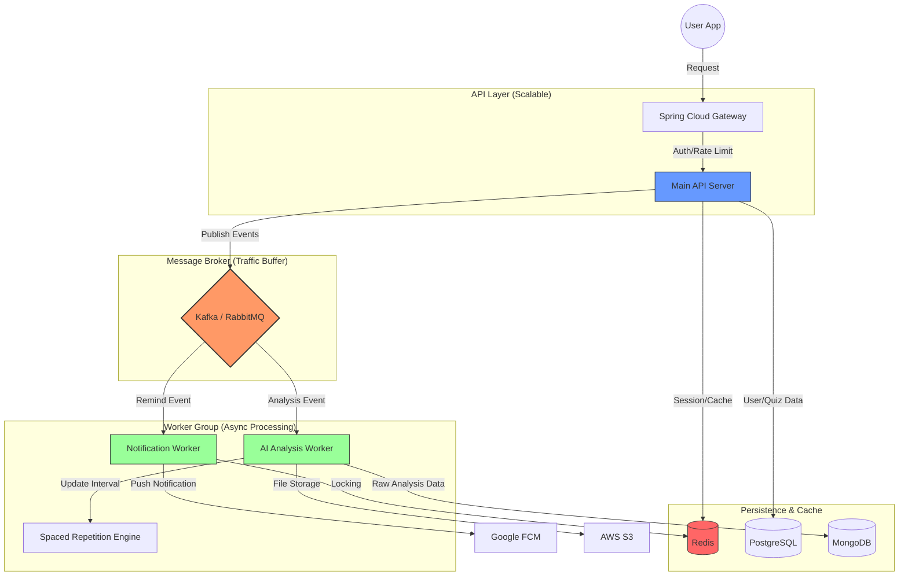

```mermaid
graph TD
    %% 사용자 및 진입점
    User((User App)) -->|Request| GW[Spring Cloud Gateway]
    
    %% 게이트웨이 및 API 서버
    subgraph "API Layer (Scalable)"
        GW -->|Auth/Rate Limit| API[Main API Server]
    end

    %% 메시지 브로커 (트래픽 완충지대)
    subgraph "Message Broker (Traffic Buffer)"
        API -->|Publish Events| Kafka{Kafka / RabbitMQ}
    end

    %% 비동기 워커 그룹
    subgraph "Worker Group (Async Processing)"
        Kafka -->|Remind Event| NW[Notification Worker]
        Kafka -->|Analysis Event| AW[AI Analysis Worker]
        AW -->|Update Interval| SM[Spaced Repetition Engine]
    end

    %% 데이터 저장소
    subgraph "Persistence & Cache"
        API -->|Session/Cache| Redis[(Redis)]
        NW -->|Locking| Redis
        API -->|User/Quiz Data| RDB[(PostgreSQL)]
        AW -->|Raw Analysis Data| NoSQL[(MongoDB)]
    end

    %% 외부 서비스
    NW -->|Push Notification| FCM[Google FCM]
    AW -->|File Storage| S3[AWS S3]

    %% 스타일링
    style Kafka fill:#f96,stroke:#333,stroke-width:2px
    style Redis fill:#f66,stroke:#333
    style API fill:#69f,stroke:#333
    style NW fill:#9f9,stroke:#333
    style AW fill:#9f9,stroke:#333
```